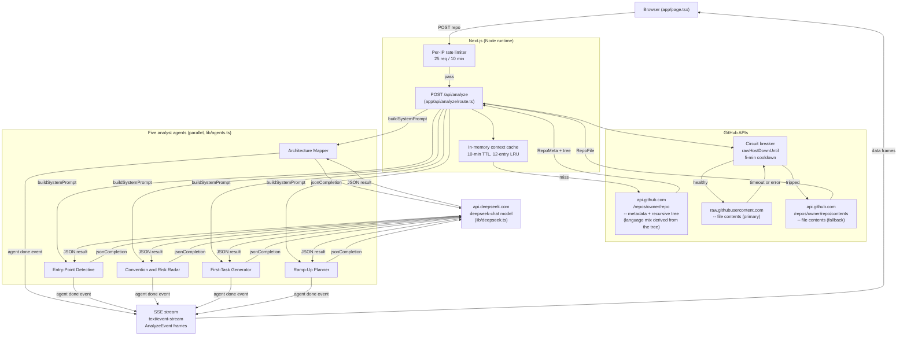
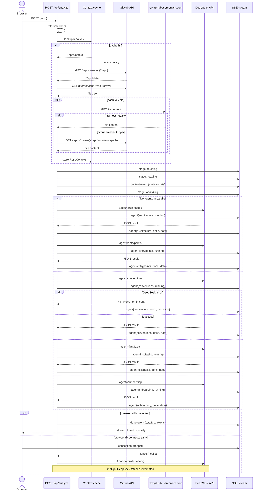
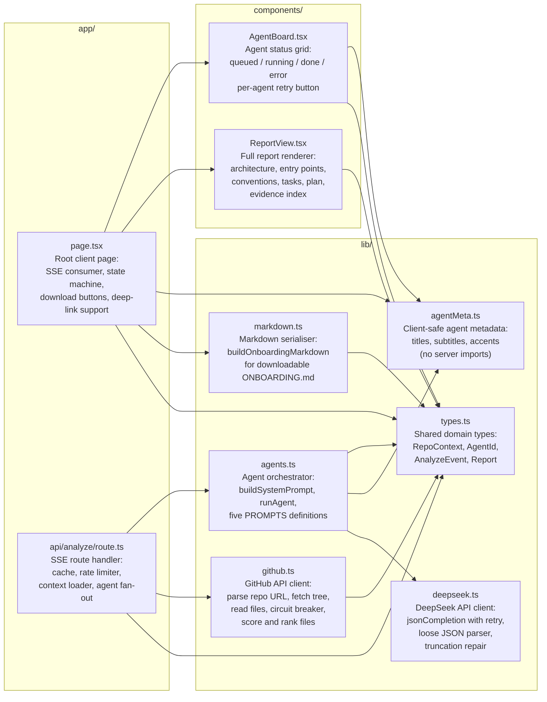
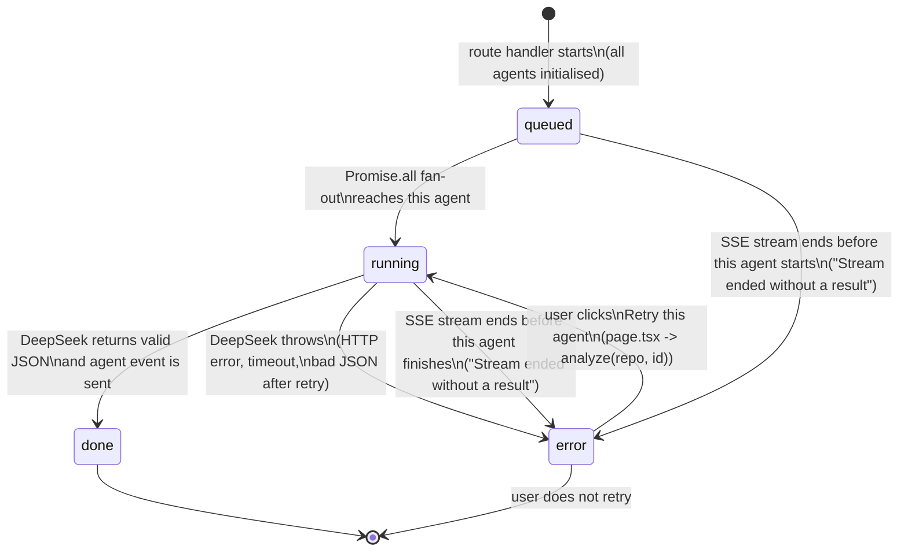
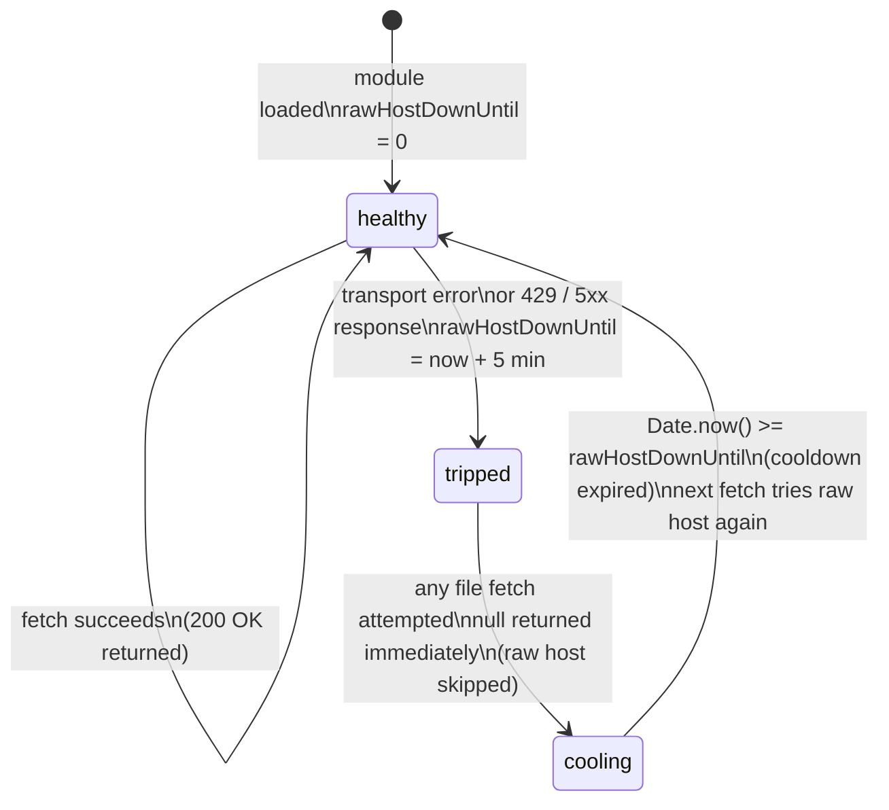

# OnboardPilot — Architecture Diagrams

## 1. Context diagram

End-to-end data flow from the browser through the Next.js route handler, GitHub APIs, the raw-content circuit breaker, the five analyst agents, and DeepSeek back to the streamed UI.

---

## 2. Sequence diagram — one full analysis request

Full lifecycle of a single POST request, including the per-agent error path and the client-disconnect abort via the `cancel()` handler.

---

## 3. Component diagram — lib/ and components/

Responsibilities of every module in `lib/` and `components/`, and the import edges between them.

---

## 4. State diagram — single analyst agent lifecycle

State machine for one agent from the moment the route handler starts processing until it is done,
errors out, or is retried from the UI. Client-disconnect handling is server-side only (see diagram 2):
the route aborts its in-flight requests and drops those agents silently, because the browser that
would have rendered their state is already gone.

---

## 5. State diagram — raw-content fetch circuit breaker

State machine for `rawHostDownUntil` in `lib/github.ts` that prevents all parallel file fetches from paying the full 5-second timeout when `raw.githubusercontent.com` is unreachable.

